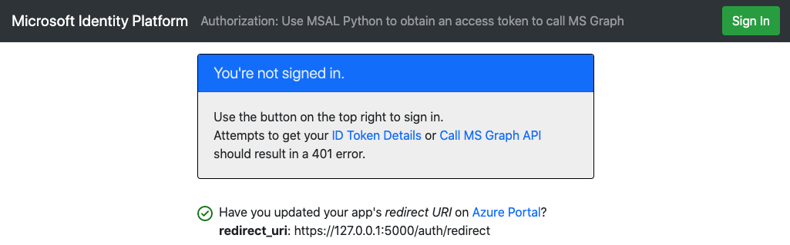

# Enable your Python Django web app to sign in users and call Microsoft Graph with the Microsoft identity platform

- [Overview](#overview)
- [Scenario](#scenario)
- [Contents](#contents)
- [Prerequisites](#prerequisites)
- [Setup](#setup)
  - [Step 1: Clone or download this repository](#step-1-clone-or-download-this-repository)
  - [Step 2: Install project dependencies](#step-2-install-project-dependencies)
- [Register the sample application(s) with your Azure Active Directory tenant](#register-the-sample-applications-with-your-azure-active-directory-tenant)
  - [Choose the Azure AD tenant where you want to create your applications](#choose-the-azure-ad-tenant-where-you-want-to-create-your-applications)
  - [Register the webapp (python-django-webapp-call-graph)](#register-the-webapp-python-django-webapp-call-graph)
  - [Configure the webapp (python-django-webapp-call-graph) to use your app registration](#configure-the-webapp-python-django-webapp-call-graph-to-use-your-app-registration)
- [Running the sample](#running-the-sample)
- [We'd love your feedback!](#wed-love-your-feedback)
- [Explore the sample](#explore-the-sample)
- [About the code](#about-the-code)
  - [Calling MS Graph](#calling-ms-graph)
  - [Scopes](#scopes)
  - [Under the hood](#under-the-hood)
- [Deploy to Azure](#deploy-to-azure)
- [More information](#more-information)
- [Community Help and Support](#community-help-and-support)
- [Contributing](#contributing)
- [Code of Conduct](#code-of-conduct)

## Overview

This sample demonstrates a Python Django web app that signs in users and obtains an access token for calling [Microsoft Graph](https://docs.microsoft.com/graph/overview). It uses the [Microsoft Authentication Library \(MSAL\) for Python](https://github.com/AzureAD/microsoft-authentication-library-for-python).


## Scenario

1. This Web application uses **MSAL for Python** to sign-in a user and obtains an [Access Token](https://docs.microsoft.com/azure/active-directory/develop/access-tokens) for [Microsoft Graph](https://docs.microsoft.com/graph/overview) from **Azure AD**:
2. The **Access Token** proves that the user is authorized to access the Microsoft Graph API endpoint as defined in the scope.

## Contents

| File/folder       | Description                                |
|-------------------|--------------------------------------------|
|`AppCreationScripts/`| Scripts to automatically configure Azure AD app registrations.|
|`app.py`           | The sample app code.                       |
|`CHANGELOG.md`     | List of changes to the sample.             |
|`CONTRIBUTING.md`  | Guidelines for contributing to the sample. |
|`LICENSE`          | The license for the sample.                |

## Prerequisites

- [Python 3.8](https://www.python.org/downloads/)
- A virtual environment to install packages listed in [requirements.txt](requirements.txt)
- An Azure Active Directory (Azure AD) tenant. For more information on how to get an Azure AD tenant, see [How to get an Azure AD tenant](https://azure.microsoft.com/documentation/articles/active-directory-howto-tenant/)
- A user account in your own Azure AD tenant. This sample will not work with a **personal Microsoft account**. If have not yet [created a user account](https://docs.microsoft.com/azure/active-directory/fundamentals/add-users-azure-active-directory) in your AD tenant yet, you should do so before proceeding.

## Setup

### Step 1: Clone or download this repository

From your shell or command line:

```Shell
git clone https://github.com/Azure-Samples/ms-identity-python-django-webapp-call-graph.git
```

or download and extract the repository .zip file.

### Step 2: Install project dependencies

1. navigate to the project folder
2. activate a Python 3 virtual environment
3. install project dependencies

- In Linux/OSX via the terminal:

```Shell
  cd <project-root-directory> #the folder into which you cloned the code
  python3 -m venv venv # only required if you don't have a venv already
  source venv/bin/activate
  pip install -r requirements.txt
```

- In Windows via PowerShell:

```PowerShell
  cd <project-root-directory> #the folder into which you cloned the code
  python3 -m venv venv # only required if you don't have a venv already
  Set-ExecutionPolicy -ExecutionPolicy RemoteSigned -Scope Process -Force
  . .\venv\Scripts\Activate.ps1
  pip install -r requirements.txt
```

## Register the sample application(s) with your Azure Active Directory tenant

There is one project in this sample. To register the app on the portal, you can:

- either follow manual configuration steps below
- or use PowerShell scripts that:
  - **automatically** creates the Azure AD applications and related objects (passwords, permissions, dependencies) for you.
  - modify the projects' configuration files.

<details>
  <summary>Expand this section if you want to use PowerShell automation.</summary>

1. On Windows, run PowerShell and navigate to the root of the cloned directory
1. In PowerShell run:

   ```PowerShell
   Set-ExecutionPolicy -ExecutionPolicy RemoteSigned -Scope Process -Force
   ```

1. Run the script to create your Azure AD application and configure the code of the sample application accordingly.
1. In PowerShell run:

   ```PowerShell
   cd .\AppCreationScripts\
   .\Configure.ps1
   ```

   > Other ways of running the scripts are described in [App Creation Scripts](./AppCreationScripts/AppCreationScripts.md)
   > The scripts also provide a guide to automated application registration, configuration and removal which can help in your CI/CD scenarios.

</details>

<details>
  <summary>Expand this section if you want to manually register and configure the application in the Azure portal.</summary>

### Choose the Azure AD tenant where you want to create your applications

As a first step you'll need to:

1. Sign in to the [Azure portal](https://portal.azure.com).
1. If your account is present in more than one Azure AD tenant, select your profile at the top right corner in the menu on top of the page, and then **switch directory** to change your portal session to the desired Azure AD tenant.

### Register the webapp (python-django-webapp-call-graph)

1. Navigate to the Microsoft identity platform for developers [App registrations](https://go.microsoft.com/fwlink/?linkid=2083908) page.
1. Select **New registration**.
1. In the **Register an application page** that appears, enter your application's registration information:
   - In the **Name** section, enter a meaningful application name that will be displayed to users of the app, for example `python-django-webapp-call-graph`.
   - Under **Supported account types**, select **Accounts in this organizational directory only**.
   - In the **Redirect URI (optional)** section, select **Web** in the combo-box and enter the following redirect URI: `http://localhost:8000/auth/redirect`.
1. Select **Register** to create the application.
1. In the app's registration screen, find and note the **Application (client) ID**. You use this value in your app's configuration file(s) later in your code.

1. Select **Save** to save your changes.

1. In the app's registration screen, click on the **Certificates & secrets** blade in the left to open the page where we can generate secrets and upload certificates.
1. In the **Client secrets** section, click on **New client secret**:
   - Type a key description (for instance `app secret`),
   - Select one of the available key durations (**In 1 year**, **In 2 years**, or **Never Expires**) as per your security concerns.
   - The generated key value will be displayed when you click the **Add** button. Copy the generated value for use in the steps later.
   - You'll need this key later in your code's configuration files. This key value will not be displayed again, and is not retrievable by any other means, so make sure to note it from the Azure portal before navigating to any other screen or blade.

### Configure the webapp (python-django-webapp-call-graph) to use your app registration

Open the project in your IDE to configure the code.

> In the steps below, "ClientID" is the same as "Application ID" or "AppId".

1. Open the `aad.config.json` file
1. Find the string `{enter-your-tenant-id-here}` and replace the existing value with your Azure AD tenant ID.
1. Find the string `{enter-your-client-id-here}` and replace the existing value with the application ID (clientId) of the `python-django-webapp-call-graph` application copied from the Azure portal.
1. Find the string `{enter-your-client-secret-here}` and replace the existing value with the key you saved during the creation of the `python-django-webapp-call-graph` app, in the Azure portal.

</details>

## Running the sample

- To run the sample, open a terminal window. Navigate to the root of the project. Be sure your virtual environment with dependencies is activated ([Prerequisites](#prerequisites)).
- On Linux/OSX via the terminal:

  ```Shell
    # start from the folder in which the sample is cloned into
    python manage.py collectstatic
    python manage.py migrate
    python manage.py runserver localhost:8000
  ```

- On Windows:

  ```PowerShell
    # start from the folder in which the sample is cloned into
    python manage.py collectstatic
    python manage.py migrate
    python manage.py runserver localhost:8000
  ```

- Navigate to [http://localhost:8000](http://localhost:8000) in your browser (**Don't use** use 127.0.0.1)



## We'd love your feedback!

Were we successful in addressing your learning objective? Consider taking a moment to [share your experience with us](https://forms.office.com/Pages/ResponsePage.aspx?id=v4j5cvGGr0GRqy180BHbR73pcsbpbxNJuZCMKN0lURpUM0dYSFlIMzdHT0o3NlRNVFpJSzcwRVMxRyQlQCN0PWcu).

## Explore the sample

- Note the signed-in or signed-out status displayed at the center of the screen.
- Click the context-sensitive button at the top right (it will read `Sign In` on first run)
- Follow the instructions on the next page to sign in with an account in the Azure AD tenant.
- On the consent screen, note the scopes that are being requested.
- Note the context-sensitive button now says `Sign out` and displays your username to its left.
- The middle of the screen now has an option to click for **ID Token Details**: click it to see some of the ID token's decoded claims.
- Click the **Call Graph** button to make a call to MS Graph API's [/users](https://docs.microsoft.comgraph/api/user-list) endpoint and fetch the details of up to 5 users in your tenant.
- You can also use the button on the top right to sign out.
- After signing out, click the link to `ID Token Details` to observe that the app displays a `401: unauthorized` error instead of the ID token claims when the user is not authorized.

> :information_source: Did the sample not work for you as expected? Did you encounter issues trying this sample? Then please reach out to us using the [GitHub Issues](../issues) page.

## About the code

This sample uses the [Microsoft Authentication Library \(MSAL\) for Python](https://github.com/AzureAD/microsoft-authentication-library-for-python) to sign in a user and obtain a token for MS Graph API. It leverages the IdentityWebPython class found in the [Microsoft Identity Python Samples Common](https://github.com/azure-samples/ms-identity-python-samples-common) repository to allow for quick app setup.

In `Sample/settings.py` class:

1. A configuration object is parsed from [aad.config.json](./aad.config.json)
1. The Azure AD configuration object are used to instantiate **IdentityWebPython**
   1. This **must** be named `MS_IDENTITY_WEB`
1. The `MsalMiddleware` class from the ms_identity_web package is added to the project's middleware

   ```python
    from ms_identity_web.configuration import AADConfig
    from ms_identity_web import IdentityWebPython
    AAD_CONFIG = AADConfig.parse_json(file_path='aad.config.json')
    MS_IDENTITY_WEB = IdentityWebPython(AAD_CONFIG)
    ERROR_TEMPLATE = 'auth/{}.html' # for rendering 401 or other errors from msal_middleware
    MIDDLEWARE.append('ms_identity_web.django.middleware.MsalMiddleware')
   ```

1. In the app's `Sample/urls.py` module, the necessary MSAL endpoints are hooked up:

    ```python
    msal_urls = MsalViews(settings.MS_IDENTITY_WEB).url_patterns()
    ...
    path(f'{settings.AAD_CONFIG.django.auth_endpoints.prefix}/', include(msal_urls)),
    ```

- The above code sets up middlwares and hooks up all necessary endpoints for the authentication process into your Django app under a route prefix (`/auth` by default). For example, the redirect endpoint is found at `/auth/redirect`.
- When a user navigates to `/auth/sign_in` and completes a sign-in attempt, the resulting identity data is put into the session, which can be accessed through the request object at `request.identity_context_data`.
- When an endpoint is decorated with `@ms_identity_web.login_required`, the application only allows requests to the endpoint from authenticated (signed-in) users. If the user is not signed-in, a `401: unauthorized` error is thrown, and the browser is redirected to the 401 handler.

    ```python
    @ms_identity_web.login_required
    def a_protected_route():
      return "if you can see this, you're signed in!"
    ```

### Calling MS Graph

When a user navigates to the `/call_ms_graph` endpoint, the following code is executed:

```python
def call_ms_graph():
    ms_identity_web.acquire_token_silently()
    graph = 'https://graph.microsoft.com/v1.0/users'
    authZ = f'Bearer {ms_identity_web.id_data._access_token}'
    results = requests.get(graph, headers={'Authorization': authZ}).json()
    return render(request, 'auth/call-graph.html', context=dict(results=results))
```

1. `ms_identity_web.acquire_token_silently()` method leverages MSAL for Python to perform a *silent token acquisition* and stores the result in the session, also accessible via  `ms_identity_web.id_data` or `request.identity_context_data`

   1. A silent token acquisition either finds a valid `access_token` with the required scopes in the token cache or uses a stored `refresh_token` to get a new `access_token` from Azure AD.

   1. The scopes herein are defined in the [aad.config.json](./aad.config.json) file, but can be overridden by passing a `scopes=["x","y"]` param to the `ms_identity_web.acquire_token_silently()` method.

2. The app then makes a request to the graph endpoint defined in (by default, `https://graph.microsoft.com/v1.0/users`). The request has an Authorization header that carries the user's `access_token` in the format `Bearer access_token_value_here`.
3. The response is sent to the template for rendering.

### Scopes

- [Scopes](https://docs.microsoft.com/en-us/azure/active-directory/develop/v2-permissions-and-consent) tell Azure AD the level of access that the application is requesting.
- Based on the requested scopes, Azure AD presents a consent dialogue to the user upon signing in.
- If the user consents to one or more scopes and obtains a token, the scopes-consented-to are encoded into the resulting `access_token`.
- Note the scope requested by the application by referring to [aad.config.json](./aad.config.json). By default, this array is set to `["User.ReadBasic.All"]`.
- This particular MS Graph API scope is for accessing the basic information of all user accounts in the user's tenant. The graph endpoint for accessing this info is `https://graph.microsoft.com/v1.0/users`
- Any valid requests made to this endpoint must bear an `access_token` containing scope `User.ReadBasic.All` in the Authorization header.

### Under the hood

In this sample, much of the required MSAL for Python configurations are automatically setup using utilities found in [Microsoft Identity Python Samples Common](https://github.com/azure-samples/ms-identity-python-samples-common). For a more direct, hands-on demonstration of the sign-in process without this abstraction, please see the code within this [Python Webapp](https://github.com/azure-samples/ms-identity-python-webapp) sample.

At a minimum, following parameters need to be provided to the MSAL for Python library:

- The **Client ID** of the app
- The **Client Credential**, which is a requirement for a Web (Confidential Client) Application.
- The **Azure AD Authority**, which includes the Tenant ID of the AAD application in this sample's scenario.

1. The first step of the sign-in process is to send a request to the `/authorize` endpoint on Azure Active Directory.

1. An MSAL for Python **ConfidentialClientApplication** instance is created by ms_identity_web, like so:

    ```python
    client_instance = msal.ConfidentialClientApplication(
      client_id=CLIENT_ID,
      client_credential=CLIENT_CREDENTIAL,
      authority=AUTHORITY,
    )
    ```

1. The `client_instance` instance is leveraged to construct a `/authorize` request URL with the appropriate parameters, and the browser is redirected to this URL.
1. The user is presented with a sign-in prompt by Azure Active Directory. If the sign-in attempt is successful, the user's browser is redirected back to this app's `/redirect` endpoint. A successful request to this endpoint will contain an **authorization code**.
1. The `client_instance` is used to exchange this authorization code for an ID Token and Access Token from Azure Active Directory.

    ```python
    token_acquisition_result = client_instance.acquire_token_by_authorization_code(authorization_code, SCOPES)
    # this sends the authorization code to Azure AD's `/token` endpoint to request a token.
    ```

1. If the request is successful, MSAL for Python validates the signature and nonce of the incoming token. If these checks succeed, it returns the resulting `id_token`, `access_token` and plaintext `id_token_claims` in a dictionary. *It is the application's responsibility to store these tokens securely.*

## Deploy to Azure

Follow [this guide](https://github.com/Azure-Samples/ms-identity-python-django-deployment) to deploy this app to **Azure App Service**.

## More information

- [Microsoft Authentication Library \(MSAL\) for Python](https://github.com/AzureAD/microsoft-authentication-library-for-python)
- [MSAL Python ReadTheDocs](https://msal-python.readthedocs.io/en/latest/)
- [Microsoft identity platform (Azure Active Directory for developers)](https://docs.microsoft.com/azure/active-directory/develop/)
- [Quickstart: Register an application with the Microsoft identity platform (Preview)](https://docs.microsoft.com/azure/active-directory/develop/quickstart-register-app)

- [Understanding Azure AD application consent experiences](https://docs.microsoft.com/azure/active-directory/develop/application-consent-experience)
- [Understand user and admin consent](https://docs.microsoft.com/azure/active-directory/develop/howto-convert-app-to-be-multi-tenant#understand-user-and-admin-consent)
- [MSAL code samples](https://docs.microsoft.com/azure/active-directory/develop/sample-v2-code)

## Community Help and Support

Use [Stack Overflow](https://stackoverflow.com/questions/tagged/msal) to get support from the community.
Ask your questions on Stack Overflow first and browse existing issues to see if someone has asked your question before.
Make sure that your questions or comments are tagged with [`azure-active-directory` `ms-identity` `adal` `msal`].

If you find a bug in the sample, please raise the issue on [GitHub Issues](../../issues).

To provide a recommendation, visit the following [User Voice page](https://feedback.azure.com/forums/169401-azure-active-directory).

## Contributing

This project welcomes contributions and suggestions. Most contributions require you to agree to a Contributor License Agreement (CLA) declaring that you have the right to, and actually do, grant us the rights to use your contribution. For details, visit https://cla.opensource.microsoft.com.

## Code of Conduct

This project has adopted the Microsoft Open Source Code of Conduct. For more information see the Code of Conduct FAQ or contact opencode@microsoft.com with any additional questions or comments.
